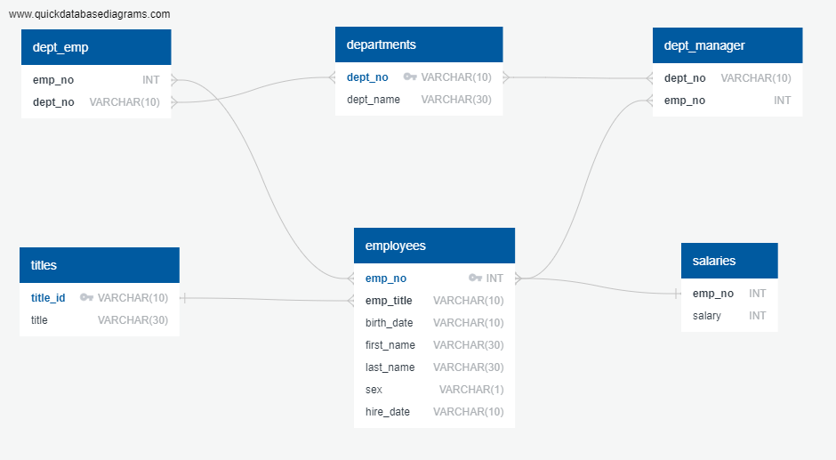
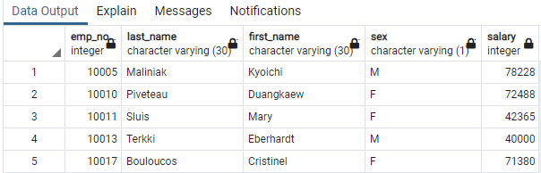
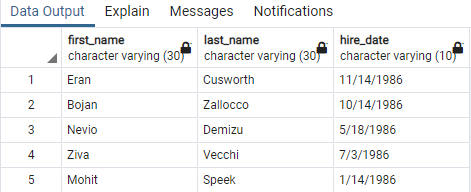
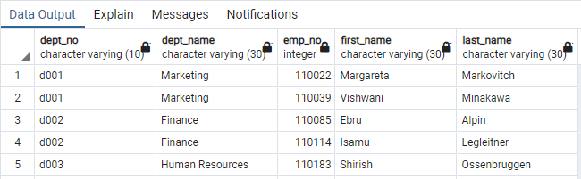
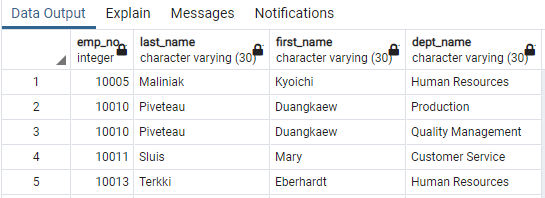
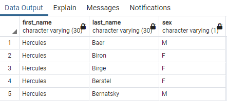
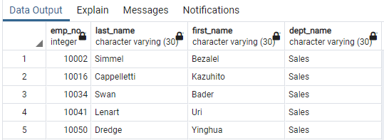
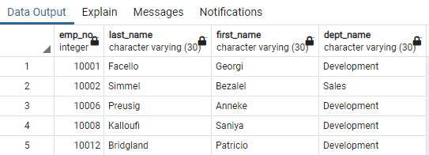
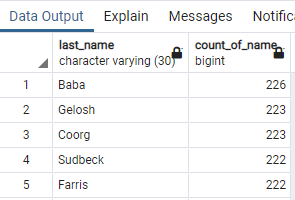
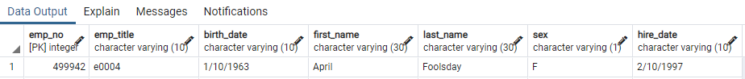

# sql-challenge

## Contents
* [Summary](#summary)
* [Main Task](#main-task)
* 1. [Data Modeling](#data-modeling)
* 2. [Data Engineering](#data-engineering)
* 3. [Data Analysis](#data-analysis)
* [Bonus Task](#bonus-task)
* [Epilogue Task](#epilogue-task)
* [Dependencies Required](#dependencies)
* [Software Used](#software)
* [Folders](#folders)
* [Files](#files)

## Summary 
In this project I was provided with a set of 6 [CSV files](EmployeeSQL/data) containing Data pertaining to a store, such as employee data and departments data.

3 steps needed to be performed:
1. Data Modeling
2. Data Engineering
3. Data Analysis

## Main Task: 

## Data Modeling 
The provided [CSV files](EmployeeSQL/data) were inspected to see what kind of data was stored to establish which Data Types and which Relationships needed to be used when creating the Table Schema.

Then an ERD (Entity Relationship Diagram) was created using the [QuickDBD](https://www.quickdatabasediagrams.com/) Web App:

## Data Engineering 
When creating the diagram the Table Names, Fields, Primary and Foreign Keys, and Data Types and Relationships were entered.

The tool creates an SQL Table Schema which you can export as a SQL file.

The resulting [Table Schema](EmployeeSQL/QuickDBD-sql-challenge.sql) for my diagram.

I created a PostgreSQL database using [pgAdmin](https://www.pgadmin.org/).

Then I entered the code contained in the Table Schema file into the SQL Query Tool and ran the Query to generate the Tables in the database.

Finally, the data from each CSV file was imported to it's relevant SQL Table using the import tool in the pgAdmin software. 

## Data Analysis 

I was given a list of 8 queries to run on the database and had to write the query code to return the information required.

Each query, code and output is shown below:

1. List the following details of each employee: employee number, last name, first name, sex, and salary.

`SELECT employees.emp_no, employees.last_name, employees.first_name, employees.sex, salaries.salary
FROM employees
JOIN salaries
ON employees.emp_no = salaries.emp_no;`

2. List first name, last name, and hire date for employees who were hired in 1986.

`SELECT first_name, last_name, hire_date
FROM employees
WHERE hire_date LIKE '%1986';`

3. List the manager of each department with the following information: department number, department name, the manager's employee number, last name, first name.

`SELECT departments.dept_no, departments.dept_name, dept_manager.emp_no, employees.first_name, employees.last_name
FROM dept_manager
JOIN departments
ON dept_manager.dept_no = departments.dept_no
JOIN employees
ON dept_manager.emp_no = employees.emp_no;`

4. List the department of each employee with the following information: employee number, last name, first name, and department name.

`SELECT employees.emp_no, employees.last_name, employees.first_name, departments.dept_name
FROM dept_emp
JOIN departments
ON dept_emp.dept_no = departments.dept_no
JOIN employees
ON dept_emp.emp_no = employees.emp_no;`

5. List first name, last name, and sex for employees whose first name is "Hercules" and last names begin with "B."

`SELECT first_name, last_name, sex
FROM employees
WHERE first_name = 'Hercules' and last_name LIKE 'B%';`

6. List all employees in the Sales department, including their employee number, last name, first name, and department name.

`SELECT employees.emp_no, employees.last_name, employees.first_name, departments.dept_name
FROM dept_emp
JOIN departments
ON dept_emp.dept_no = departments.dept_no
JOIN employees
ON dept_emp.emp_no = employees.emp_no
WHERE dept_name = 'Sales';`

7. List all employees in the Sales and Development departments, including their employee number, last name, first name, and department name.

`SELECT employees.emp_no, employees.last_name, employees.first_name, departments.dept_name
FROM dept_emp
JOIN departments
ON dept_emp.dept_no = departments.dept_no
JOIN employees
ON dept_emp.emp_no = employees.emp_no
WHERE dept_name = 'Sales' or dept_name = 'Development';`

8. In descending order, list the frequency count of employee last names, i.e., how many employees share each last name.

`SELECT last_name, COUNT(last_name) AS "count_of_name"
FROM employees
GROUP BY last_name
ORDER BY count_of_name DESC;`

## Bonus Task 

## Epilogue Task 
Search your Employee ID: 499942

`SELECT * from employees
WHERE emp_no = '499942';`

## Dependencies Required 
### Python Environment
* [Anaconda](https://www.anaconda.com/) - package management system and environment system.

### Packages
* [Jupyter Notebook](https://jupyter.org/) `pip install notebook`
* [Pandas](https://pypi.org/project/pandas/) `pip install pandas`
* [Matplotlib](https://pypi.org/project/matplotlib/) `pip install matplotlib`
* [SQLAlchemy](https://pypi.org/project/SQLAlchemy/) `pip install SQLAlchemy`
* [Psycopg2](https://pypi.org/project/psycopg2/) `pip install psycopg2`

You can also use 'conda install' instead of 'pip install'.

## Software Used 
* [Quick DBD](https://www.quickdatabasediagrams.com/) Web App
* [pgAdmin](https://www.pgadmin.org/)

## Folders 
* All files aside from this README and images used in the README, are stored in the [EmployeeSQL](EmployeeSQL) folder.

* Images for this README file are stored in the [Readme_images](Readme_images/) folder.

* Any diagrams or plots outputted via the code are stored in the [EmployeeSQL/Images](EmployeeSQL/images) folder.

* The original CSV data files that were imported and processed are stored in the [EmployeeSQL/data](EmployeeSQL/data) folder.

## Files 

* QuickDBD-sql-challenge.png

