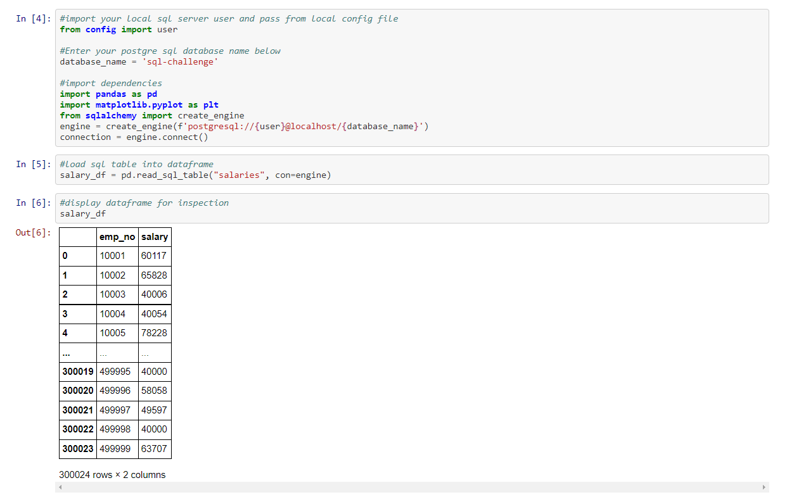

# SQL - Data Modeling, Engineering and Analysis

## Contents
* [Summary](#summary)
* [Main Task](#main-task)
* 1. [Data Modeling](#data-modeling)
* 2. [Data Engineering](#data-engineering)
* 3. [Data Analysis](#data-analysis)
* [SQL Alchemy](#sql-alchemy)
* [Dependencies Required](#dependencies)

## Summary 
In this project I was provided with a set of 6 [CSV files](#files) containing Data pertaining to a store, such as employee data and departments data.

8 sets of information were required. In order to query the database to return the required information, 3 steps needed to be performed:
1. [Data Modeling](#data-modeling)
2. [Data Engineering](#data-engineering)
3. [Data Analysis](#data-analysis)

All of the files containing the code for the Table Schema, SQL Queries and Bonus Task are referenced in the [Files](#files) section.

## Main Task: 

## i. Data Modeling 
The provided [CSV files](#files) were inspected to see what kind of data was stored to establish which Data Types and which Relationships needed to be used when creating the Table Schema.

Then an ERD (Entity Relationship Diagram) was created using the [QuickDBD](#quickdbd) Web App:

## ii. Data Engineering 
When creating the diagram the Table Names, Fields, Primary and Foreign Keys, Data Types, and Relationships, were entered.

The tool creates an SQL Table Schema which you can export as a SQL file. The resulting [Table Schema](#schema) for my diagram.

I created a PostgreSQL database using [pgAdmin](#pgadmin).

Then I entered the code contained in the Table Schema file into the SQL Query Tool and ran the Query to generate the Tables in the database.

Finally, the data from each CSV file was imported to it's relevant SQL Table using the import tool in the pgAdmin software. 

## iii. Data Analysis 

I was given a list of 8 set of information required and to had to create SQL Queries to run on the database to return the information required.

Each query, code and output is shown below:

1. List the following details of each employee: employee number, last name, first name, sex, and salary.

`SELECT employees.emp_no, employees.last_name, employees.first_name, employees.sex, salaries.salary
FROM employees
JOIN salaries
ON employees.emp_no = salaries.emp_no;`

2. List first name, last name, and hire date for employees who were hired in 1986.

`SELECT first_name, last_name, hire_date
FROM employees
WHERE hire_date LIKE '%1986';`

3. List the manager of each department with the following information: department number, department name, the manager's employee number, last name, first name.

`SELECT departments.dept_no, departments.dept_name, dept_manager.emp_no, employees.first_name, employees.last_name
FROM dept_manager
JOIN departments
ON dept_manager.dept_no = departments.dept_no
JOIN employees
ON dept_manager.emp_no = employees.emp_no;`

4. List the department of each employee with the following information: employee number, last name, first name, and department name.

`SELECT employees.emp_no, employees.last_name, employees.first_name, departments.dept_name
FROM dept_emp
JOIN departments
ON dept_emp.dept_no = departments.dept_no
JOIN employees
ON dept_emp.emp_no = employees.emp_no;`

5. List first name, last name, and sex for employees whose first name is "Hercules" and last names begin with "B."

`SELECT first_name, last_name, sex
FROM employees
WHERE first_name = 'Hercules' and last_name LIKE 'B%';`

6. List all employees in the Sales department, including their employee number, last name, first name, and department name.

`SELECT employees.emp_no, employees.last_name, employees.first_name, departments.dept_name
FROM dept_emp
JOIN departments
ON dept_emp.dept_no = departments.dept_no
JOIN employees
ON dept_emp.emp_no = employees.emp_no
WHERE dept_name = 'Sales';`

7. List all employees in the Sales and Development departments, including their employee number, last name, first name, and department name.

`SELECT employees.emp_no, employees.last_name, employees.first_name, departments.dept_name
FROM dept_emp
JOIN departments
ON dept_emp.dept_no = departments.dept_no
JOIN employees
ON dept_emp.emp_no = employees.emp_no
WHERE dept_name = 'Sales' or dept_name = 'Development';`

8. In descending order, list the frequency count of employee last names, i.e., how many employees share each last name.

`SELECT last_name, COUNT(last_name) AS "count_of_name"
FROM employees
GROUP BY last_name
ORDER BY count_of_name DESC;`

## SQL Alchemy 

The code for this section is contained within the [SQL-Alchemy .ipynb](#sql-alchemy-notebook) Jupyter Notebook file contained in the repository.

I created a [Config.py](#config) file and entered the username and password of my locally hosted PostgreSQL server into a variable in this file. The Config .py file was then referenced in the .gitignore file so the user name and password is not pushed to the repository.

The section required the use of the [SQLAlchemy](#sqlalchemy) package to connect to the PostgreSQL database so that data could be extracted and manipulated using [Pandas](#pandas).

Once the data was imported into Pandas DataFrames I had to create a Histogram plot of Employee Salaries.

And I also had to create a bar plot of Average Salary by Title.

The code for these plots is below:

Using [Jupyter notebook](#jupyter-notebook) I first imported dependencies, including the variable from the [config](#config) file containing the user and pass for the local PostgreSQL server.

The database_name variable should contain the name of the database in your server where the tables in this project were created.

Once the database connection was made using SQL Alchemy:

I used the 'pd.read_sql' function to read the Salary Table from the local PostgreSQL database into a Pandas DataFrame.

Then using the Pandas dataframe plot function I was able to plot a histogram of employee salaries from the Data in the Salary DataFrame.

I then had to create a bar plot of Average Salary by Employee Title.

For this I imported the Employee and Title SQL tables into their own Pandas DataFrames.

Then I used the Pandas Merge function to merge the Employee DataFame with the with Title DataFrame on the title_id column.

Then this newly merged DataFrame was merged again with the Salary DataFrame on the emp_no column.

The final merged DataFrame contained all the fields necessary to create a plot of the Average Salary By Title.

I had to use the .groupby function to group by Title.

Then used the .mean function on the groupby to get the average salary for each title.

Finally I was able to use the Pandas .plot function to create a bar plot of the Average Salaries By Title.

## Dependencies Required 
### Packages
* Packages used are in the requirements.txt.

### Config File 
You will also need to create "Config.py" inside the EmployeeSQL folder. The file should contain a variable called 'user' which contains your local PostgreSQL server username and password.

This file is referenced in the .gitignore file so it's not pushed to the repository.

